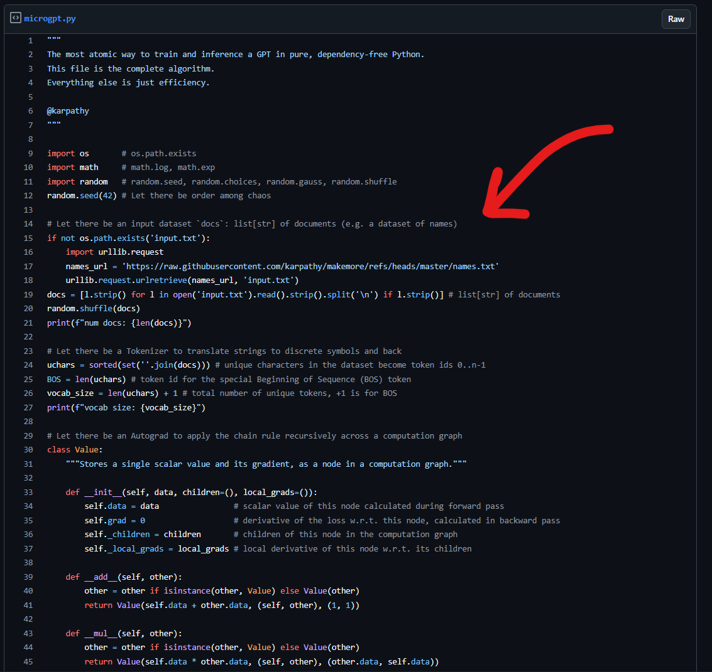

<h1 align="center">PicoGPT: GPT in a QR Code</h1>

    

    Yes, it's small enough to fit inside a QR code. You can <a href="https://scanqr.org/">scan it</a> to try it out.

## Origin

Andrej Karpathy tweeted this on X today, talking about [MicroGPT](https://gist.github.com/karpathy/8627fe009c40f57531cb18360106ce95)

    

It was genuinely so cool but then I saw something that made me laugh out loud

    

IT WASN'T MINIFIED FURTHER

So uh yeah, that's all this is, I minified it further at [picogpt.py](picogpt.py)

The `qrgen.py` script is adapted from my **Doom running inside a QR code** project: [backdooms](https://github.com/kuberwastaken/backdooms).

As for the naming choice, iykyk